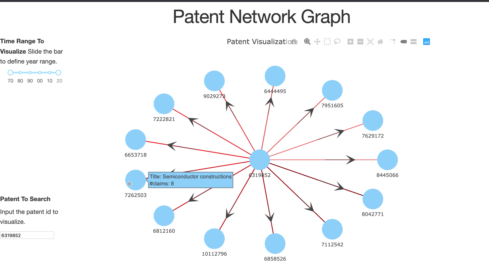

# insight_project_patent_network
1. The project builds a data warehouse for the patent records from uspto
2. The project provides a web demo for customer to check the connections of their interested patents
3. The project shows the title of one patent you interested in and the other patents citing it (with titles and dates)

#### Description for scripts
* 
